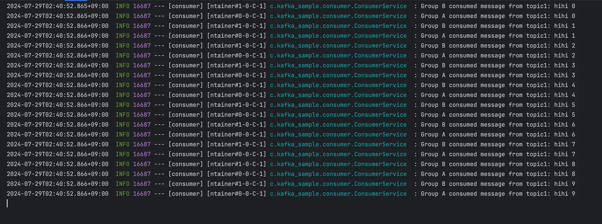

- Kafka 설치: Docker-compose 사용 실습

Kafka의 메세지 소비는 토픽과 컨슈머 그룹의 조합으로 결정된다.

1. `같은 토픽` & `같은 그룹`
- 그룹 내 하나의 컨슈머만 메세지를 받음

---

2. `같은 토픽` & `다른 그룹`
- `localhost:8090/send?topic=topic1&key=key-1&message=hihi`
- `topic`: topic1
- `key`: key-1
- `message`: hihi

컨슈머 애플리케이션의 로그를 보면 GroupA와 GroupB가 메세지를 수신한 것을 확인할 수 있다.
따라서 `같은 토픽을 가지고` `그룹이 다르면` 메세지를 각 그룹마다 수신한다는 것을 알 수 있다.

같은 토픽 / 다른 그룹 로그

✅ 같은 토픽이라도, 그룹이 다르면 각 그룹이 메세지를 각자 소비

---

3. `다른 토픽` `같은 그룹`

- `topic2 지정`
- `localhost:8090/send?topic=topic2&key=key-1&message=hihi`
Group C이고 topic이 2인 리스너가 메세지를 수신한 것을 확인할 수 있다.

- `topic3 지정`
- `localhost:8090/send?topic=topic3&key=key-1&message=hihi`
Group C이고 topic이 3인 리스너가 메세지를 수신한 것을 확인할 수 있다.

✅ 같은 그룹이라도, 토픽이 다르면 해당 토픽의 리스너만 메세지를 받는다 (독립)

---

4. `다른 토픽` `다른 그룹`

- `topic4 지정`
- `localhost:8090/send?topic=topic4&key=key-1&message=hihi`
Group D이고 topic이 4인 리스너가 메세지를 수신한 것을 확인할 수 있다.

✅ 토픽이 다르고, 그룹도 다르면 완전 별개의 흐름

