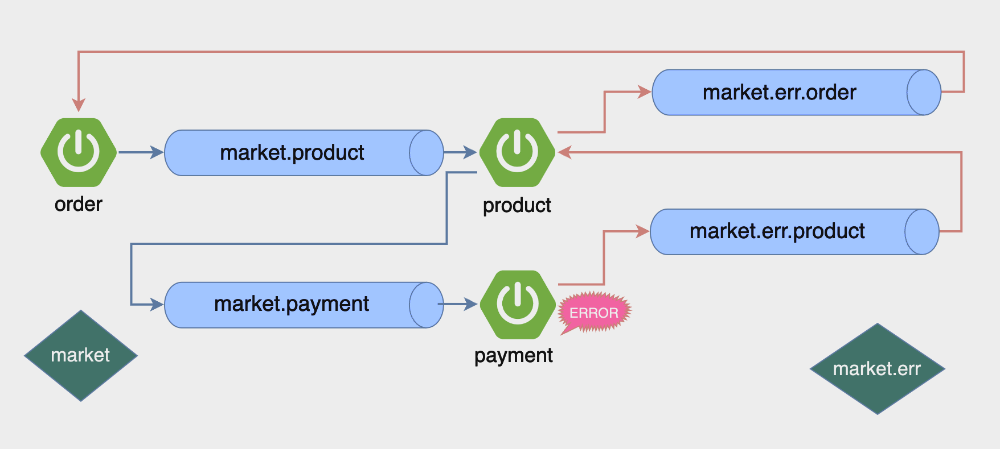

### 정상 동작 (왼쪽)
1. order에 엔드포인트를 만들어 사용자의 데이터를 입력 받는 걸 만들고,
DB 대신 내부 메모리를 쓴 orderStore를 만들어 생성된 데이터를 넣음
2. RabbitTemplate를 통해 큐로 넣는 작업
3. productApplication에서 큐에 있는 데이터를 가져오는 컨슈밍 작업
4. product에서 다시 market.payment 큐로 넣는 작업
5. paymentApplication에서 위 메세지를 넣는 작업 진행

### 에러 과정 (오른쪽)
1. payment에 에러가 난 케이스를 만들어 market.err.product 큐로 이동시키는 과정 생성
2. error.product에서 productApplication이 error.product 큐를 바라보게 만들어 product 큐가 그 에러를 핸들링 할 수 있도록 생성
3. market.err.order 큐로 그 데이터를 다시 전달
4. orderApplication이 market.err.order를 바라보게 만들어서 메세지를 가져오고,
5. 그 메세지를 통해 order 스토어에 있는 정보를 업데이트
